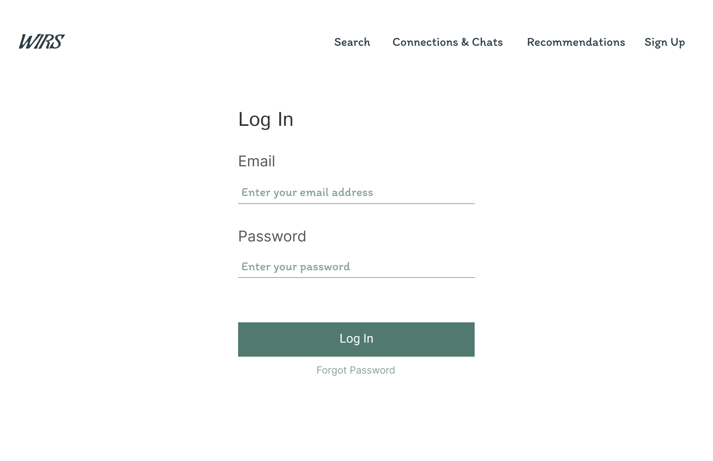
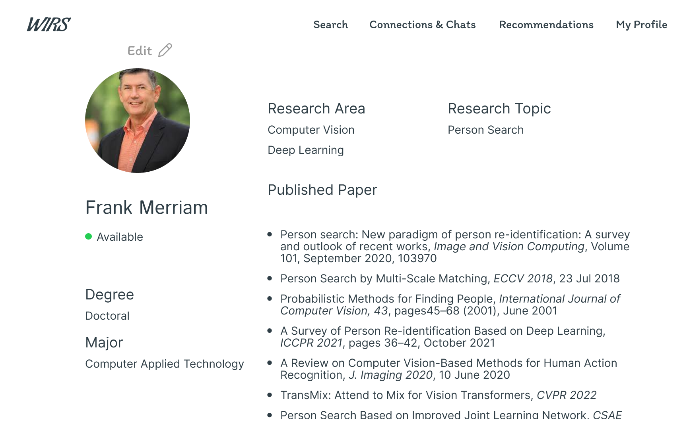
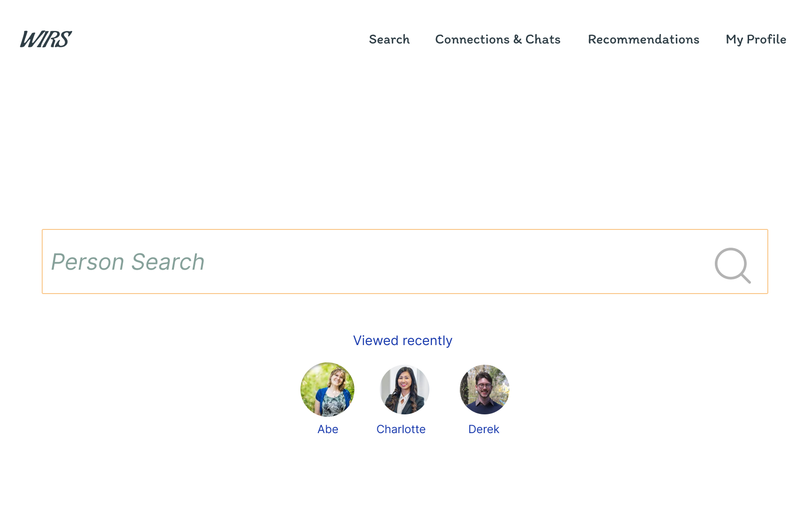
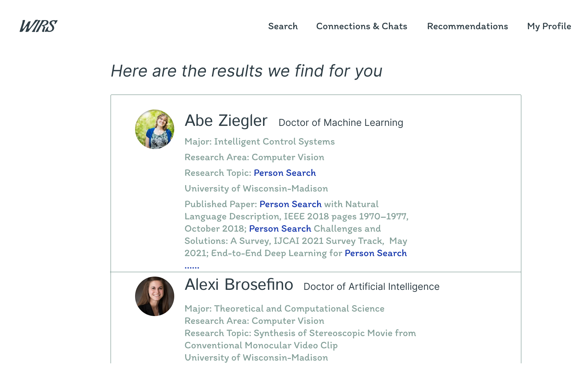
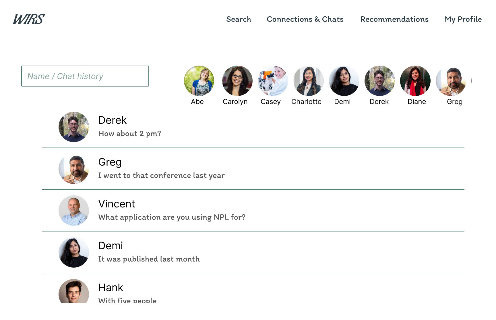
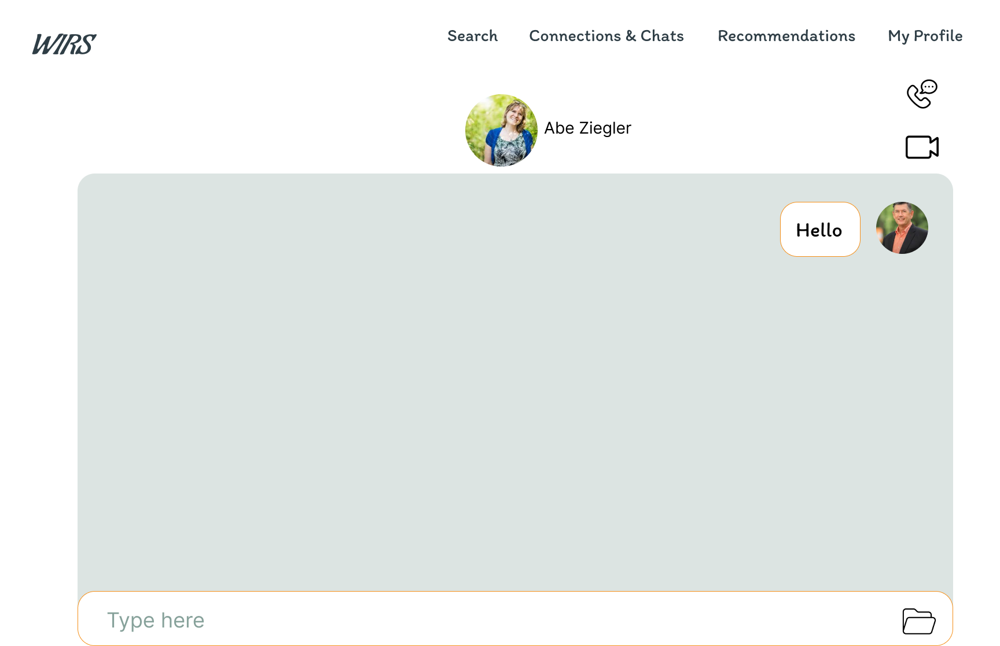
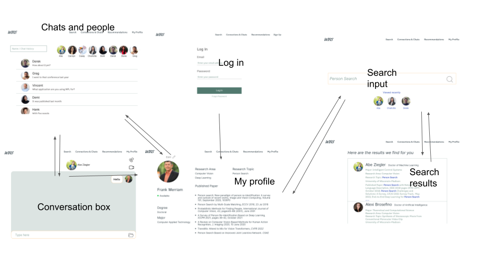

# We Research

## Overview

Academics usually find collaborators for research among their acquaintances. What if they need experts outside their current connections? Today, there is a website for academics to build their profiles, so they can show their research interests.

The website allows users to search for people who have showed related qualifications in their profiles. Users can view profiles and chat with people to communicate their research ideas. Through communications, users are able to find collaborators as well as connect with others.


## Data Model

The application will store Users, 

An Example User:

```javascript
{
  username: "weresearch",
  hash: // a password hash,
  lists: // an array of references of user information in profile
}
```

An Example List:

```javascript
{
  user: // a reference to a User object
  search: "person search",
  viewed: [
    { name: "Johhh", research _area: "Computer Vision", research_topic: "Person Search"},
    { name: "Ivln", research _area: "Computer Vision", research_topic: "Person Search"},
  ],
 chats: [
     {name:"Tojj", time: "// chat list sorted from newest to oldest", contents: "//conversations"}
  ],
  createdAt: // timestamp
}
```


## [Link to Commented First Draft Schema](db.mjs) 

[db.mjs](db.mjs)


## Wireframes

login - user log in



profile - page for user academic information



search - page for input keywords for searching



search display - page for showing search results



chat and connection lists - pages for review chats and people who have chatted






## Site map



## User Stories or Use Cases
1. as non-registered user, I can register a new account with the site
2. as a user, I can log in to the site
3. as a user, I can build my profile
4. as a user, I can search potential collaborators by keywords
5. as a user, I can chat with other users
6. as a user, I can view other users' profiles


## Research Topics

* React
    * components for better organization
    * 5 points since it is a primary use
* Unit testing with js
    * Mocha
    * 3 points


## [Link to Initial Main Project File](app.mjs) 
[app.mjs](app.mjs)

